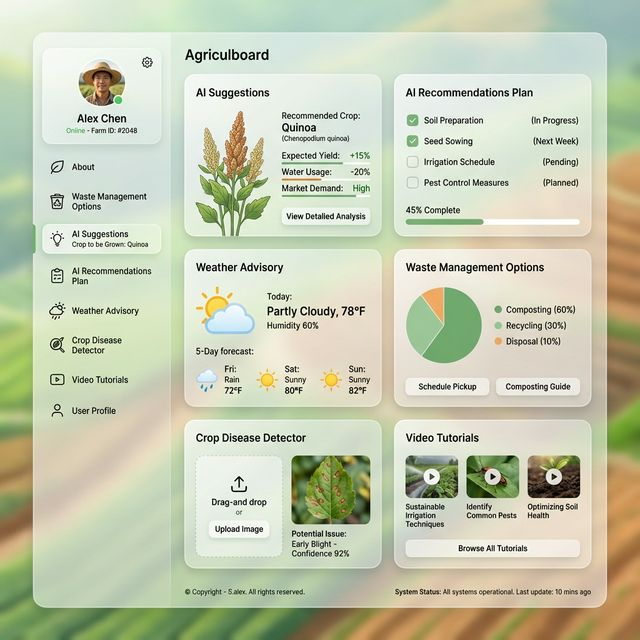

# Agriwaste Full-Stack Application


Welcome to the Agriwaste project! This is a full-stack application containing a React frontend (Vite) and an Express.js backend (Node.js).

## Project Structure

- `/backend`: The Node.js and Express backend server. It handles API requests, database interactions (MongoDB), and external API calls (e.g., OpenWeather).
- `/project`: The Vite-powered React frontend project. It contains UI components, pages, and interactive elements.

## Getting Started

To run this application, you will need to start both the backend and the frontend servers.

### 1. Start the Backend Worker

Navigate to the `backend` directory and start the server:

```bash
cd backend
npm install
npm run dev
```

The backend typically runs on port 5000 (configurable via `.env`).

### 2. Start the Frontend Application

Navigate to the `project` directory and start the development server:

```bash
cd project
npm install
npm run dev
```

The frontend typically runs on port 5173. Open your browser and navigate to `http://localhost:5173` to see the application.

## Core Features
1. **Weather Advisory**: Uses OpenWeather API to fetch weather and provide basic agricultural advisories.
2. **AI Crop Suggestions & Recommendations**: Leverages the powerful **Groq AI** to dynamically suggest crops to be grown based on location, soil type, sunlight, and type of agricultural waste.
3. Multiple UI modules for agriculture management such as standard suggestions, disease detectors, and video tutorials.

---
*For more specific details, see the README files inside the `backend` and `project` folders.*
