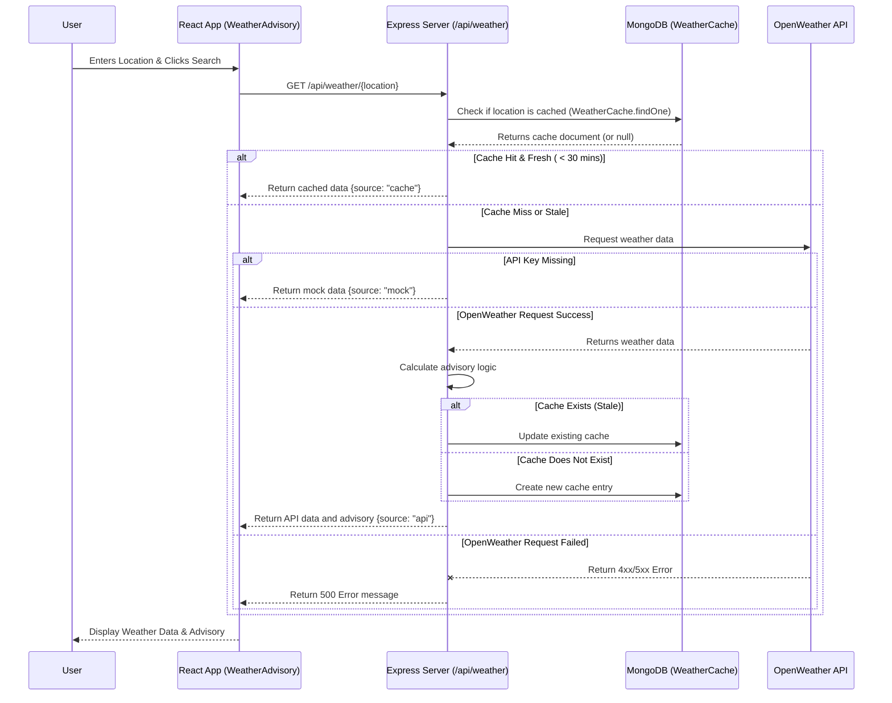
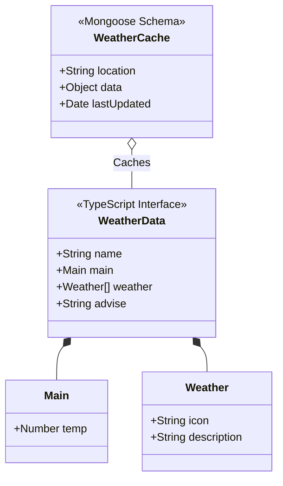
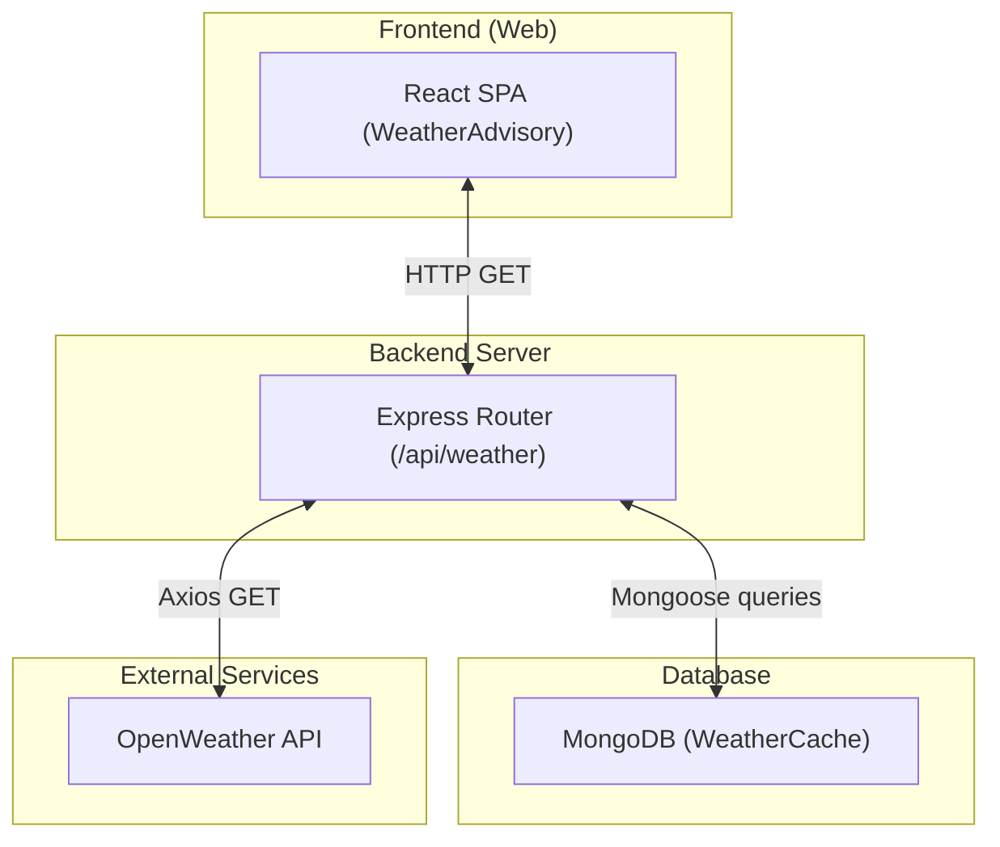
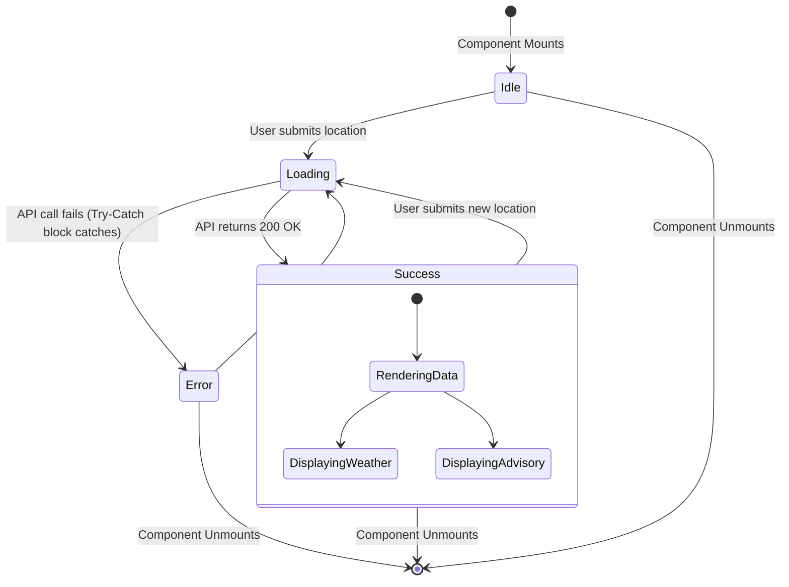

# Weather API - UML Diagrams

This document contains Mermaid UML diagrams detailing the structure and flow of the Weather API feature in the Agriwaste application.

## 1. Sequence Diagram
Illustrates how the frontend (React), backend (Express), database (MongoDB), and OpenWeather API communicate to fulfill a user's weather request.



## 2. Activity Diagram (Flowchart)
Details the backend internal logic residing in `weather.js` that dictates when to use the cache or external API.


## 3. Class Diagram / Data Model
Shows the Object-Oriented/Document structure used for caching data and the TypeScript interfaces used on the frontend.



## 4. Component / Architecture Diagram
Represents the structural breakdown of the systems involved in the weather advisory feature.



## 5. State Diagram
Represents the state array of the UI Component (`WeatherAdvisory.tsx`) as the user interacts with the app.



## 6. Use Case Diagram
Highlights user interactions and system boundary.

```mermaid
flowchart LR
    subgraph Actors
        Farmer(("User/Farmer"))
        OpenWeather(("OpenWeather System"))
        Mongo(("Database System"))
    end

    subgraph Weather Advisory System
        UC1(["Input Location"])
        UC2(["View Current Weather"])
        UC3(["Read Farming Advisory"])
        UC4(["Validate Cache"])
        UC5(["Fetch Live Data"])
    end

    Farmer --> UC1
    Farmer --> UC2
    Farmer --> UC3

    UC1 -.->|includes| UC2
    UC2 -.->|includes| UC3

    UC2 -.->|include| UC4
    UC4 --> Mongo

    UC4 -.->|extends (if cache miss)| UC5
    UC5 --> OpenWeather
```
