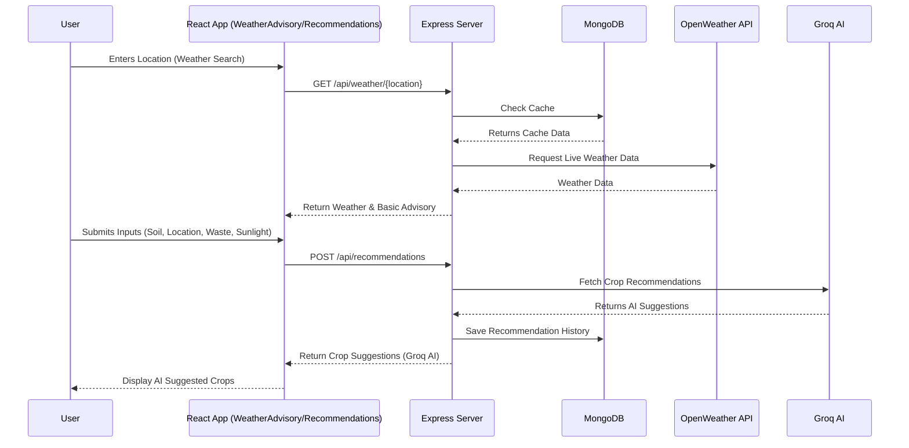
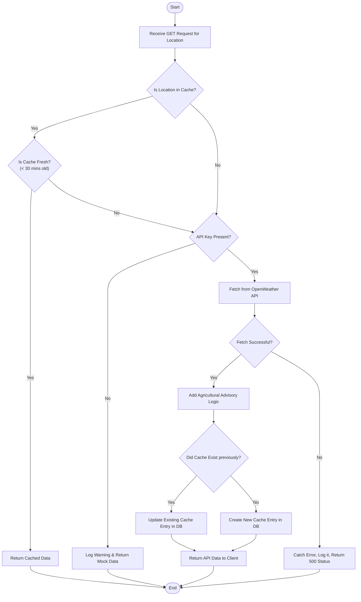
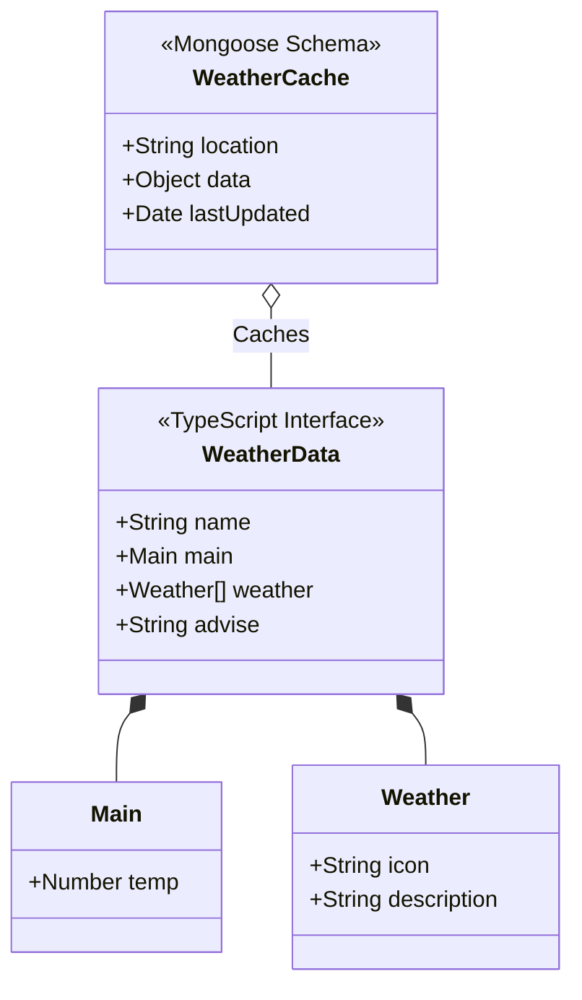
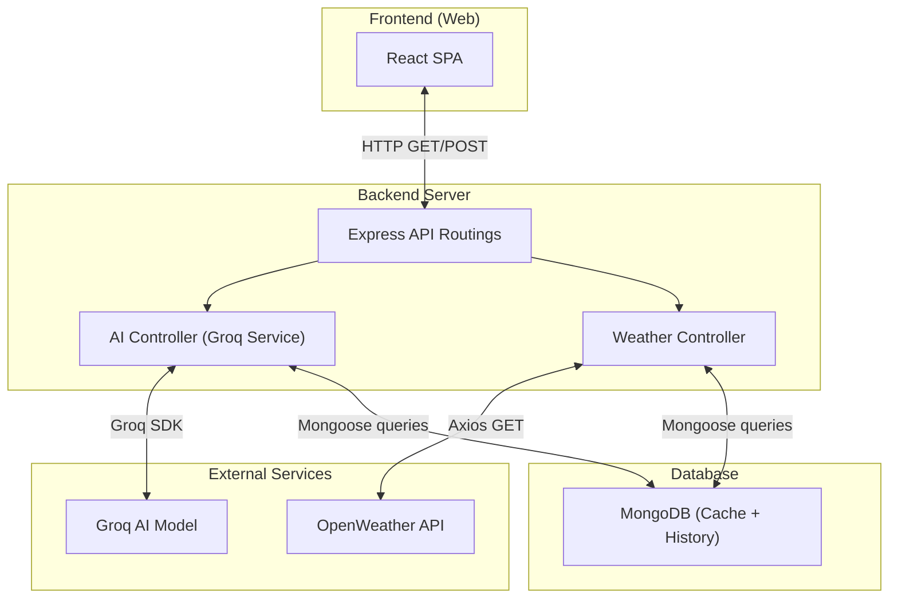
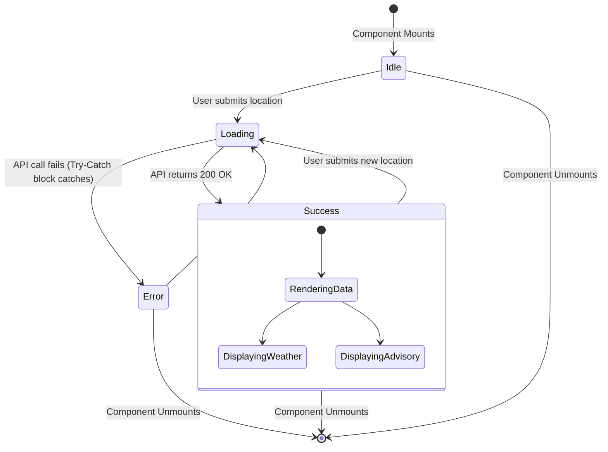
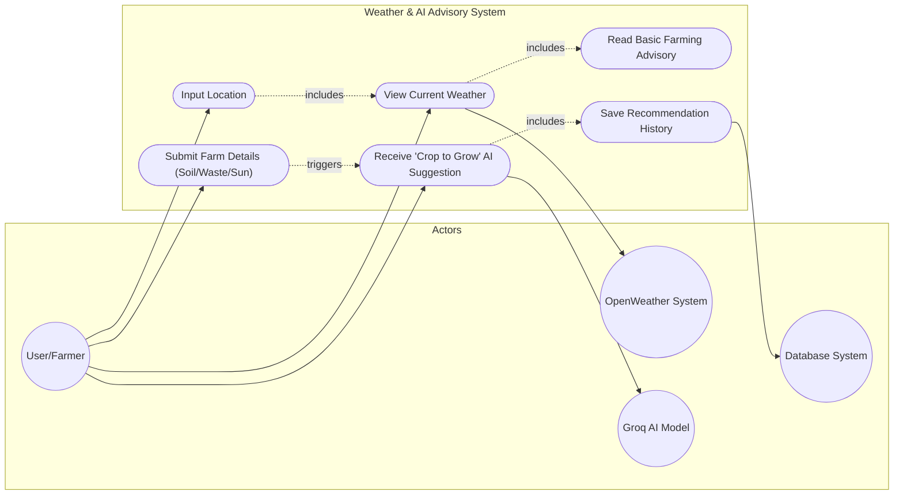

# Weather API - UML Diagrams

This document contains Mermaid UML diagrams detailing the structure and flow of the Weather API feature in the Agriwaste application.

## 1. Sequence Diagram
Illustrates how the frontend (React), backend (Express), database (MongoDB), and OpenWeather API communicate to fulfill a user's weather request.

## 2. Activity Diagram (Flowchart)
Details the backend internal logic residing in `weather.js` that dictates when to use the cache or external API.

## 3. Class Diagram / Data Model
Shows the Object-Oriented/Document structure used for caching data and the TypeScript interfaces used on the frontend.

## 4. Component / Architecture Diagram
Represents the structural breakdown of the systems involved in the weather advisory feature.

## 5. State Diagram
Represents the state array of the UI Component (`WeatherAdvisory.tsx`) as the user interacts with the app.

## 6. Use Case Diagram
Highlights user interactions and system boundary.

